Examples
==============================

.. code:: python

    %matplotlib inline

.. code:: python

    from __future__ import print_function
    import pandas as pd
    try:
        import seaborn
    except:
        pass
    from climate_index import database, print_database, plot_climate_index

Print the climate index database
~~~~~~~~~~~~~~~~~~~~~~~~~~~~~~~~

.. code:: python

    print_database()

.. parsed-literal::

    AMO
         Atlantic multidecadal oscillation SST Index
         http://www.esrl.noaa.gov/psd/gcos_wgsp/Timeseries/Data/amo.long.data
    AMO_DETREND
         Atlantic multidecadal oscillation SST Index (detrended)
         http://www.esrl.noaa.gov/psd/data/correlation//amon.us.long.data
    AMO_DETREND_SM
         Atlantic multidecadal oscillation SST Index (detrended, smoothed)
         http://www.esrl.noaa.gov/psd/data/correlation/amon.sm.long.data
    AMO_SM
         Atlantic multidecadal oscillation SST Index (smoothed)
         http://www.esrl.noaa.gov/psd/gcos_wgsp/Timeseries/Data/amo.sm.long.data
    AO
         Arctic Oscillation Index
         http://www.esrl.noaa.gov/psd/gcos_wgsp/Timeseries/Data/ao.long.data
    AO20R
         Arctic Oscillation Index from the 20thC Reanalysis
         http://www.esrl.noaa.gov/psd/gcos_wgsp/Timeseries/Data/ao20thc.long.data
    AP
         Ponta Delgada, Azores SLP
         http://www.esrl.noaa.gov/psd/gcos_wgsp/Timeseries/Data/nao_azo.long.data
    GLOBAL_T_CRU
         Global Average Temperature Anomaly (CRU)
         http://www.esrl.noaa.gov/psd/gcos_wgsp/Timeseries/Data/taveglhc4.long.data
    GLOBAL_T_SST
         Global Average Temperature & SST Anomalies (Station + SST)
         http://www.esrl.noaa.gov/psd/gcos_wgsp/Timeseries/Data/GLBTSSST.long.data
    GLOBAL_T_STATION
         Global Average Temperature Anomalies (Station Only)
         http://www.esrl.noaa.gov/psd/gcos_wgsp/Timeseries/Data/GLBTS.long.data
    GP
         Gibraltar SLP
         http://www.esrl.noaa.gov/psd/gcos_wgsp/Timeseries/Data/nao_gib.long.data
    IP
         Iceland SLP
         http://www.esrl.noaa.gov/psd/gcos_wgsp/Timeseries/Data/nao_ice.long.data
    MP
         Madras SLP
         http://www.esrl.noaa.gov/psd/gcos_wgsp/Timeseries/Data/madrasslp.long.data
    NAO
         North Atlantic Oscillation
         http://www.esrl.noaa.gov/psd/gcos_wgsp/Timeseries/Data/nao.long.data
    NINO12
         Nino 1+2 SST Index
         http://www.esrl.noaa.gov/psd/gcos_wgsp/Timeseries/Data/nino12.long.anom.data
    NINO3
         Nino 3 SST Index
         http://www.esrl.noaa.gov/psd/gcos_wgsp/Timeseries/Data/nino3.long.anom.data
    NINO34
         Nino 3.4 SST Index
         http://www.esrl.noaa.gov/psd/gcos_wgsp/Timeseries/Data/nino34.long.anom.data
    NINO4
         Nino 4 SST Index
         http://www.esrl.noaa.gov/psd/gcos_wgsp/Timeseries/Data/nino4.long.anom.data
    NP
         North Pacific Index
         http://www.esrl.noaa.gov/psd/gcos_wgsp/Timeseries/Data/np.long.data
    NSLP
         Nagasaki SLP
         http://www.esrl.noaa.gov/psd/gcos_wgsp/Timeseries/Data/nagasakipres.long.data
    PDO
         Pacific Decadal Oscillation
         http://www.esrl.noaa.gov/psd/gcos_wgsp/Timeseries/Data/pdo.long.data
    RNAO
         Reconstructed monthly NAO index back to December 1658
         http://www.esrl.noaa.gov/psd/gcos_wgsp/Timeseries/Data/rnao.long.data
    SOI
         Southern Oscillation Index
         http://www.esrl.noaa.gov/psd/gcos_wgsp/Timeseries/Data/soi.long.data
    SUNSPOT
         Sunspot Index
         http://www.esrl.noaa.gov/psd/gcos_wgsp/Timeseries/Data/sunspot.long.data
    TP
         Trans Polar Index
         http://www.esrl.noaa.gov/psd/gcos_wgsp/Timeseries/Data/tpi.long.data

Show each climate index
~~~~~~~~~~~~~~~~~~~~~~~

.. code:: python

    print(database['amo']['long_name'])
    print(database['amo_sm']['long_name'])
    plot_climate_index('amo')
    plot_climate_index('amo_sm')

.. parsed-literal::

    Atlantic multidecadal oscillation SST Index
    Atlantic multidecadal oscillation SST Index (smoothed)

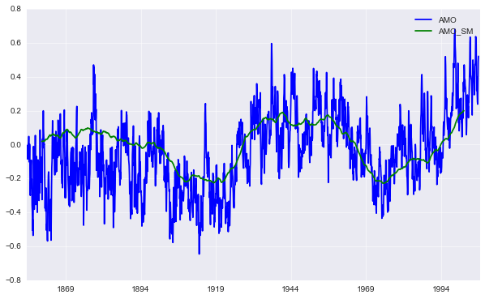

.. code:: python

    print(database['amo_detrend']['long_name'])
    print(database['amo_detrend_sm']['long_name'])
    plot_climate_index('amo_detrend')
    plot_climate_index('amo_detrend_sm')

.. parsed-literal::

    Atlantic multidecadal oscillation SST Index (detrended)
    Atlantic multidecadal oscillation SST Index (detrended, smoothed)

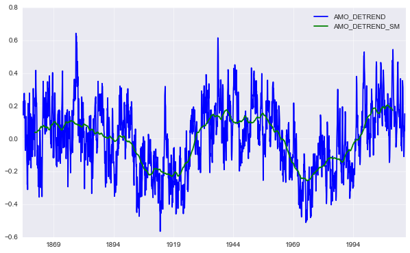

.. code:: python

    print(database['ao']['long_name'])
    plot_climate_index('ao')

.. parsed-literal::

    Arctic Oscillation Index

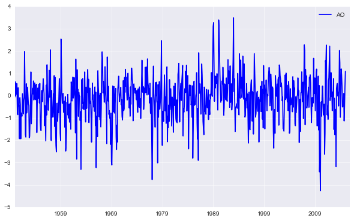

.. code:: python

    print(database['ao20r']['long_name'])
    plot_climate_index('ao20r')

.. parsed-literal::

    Arctic Oscillation Index from the 20thC Reanalysis

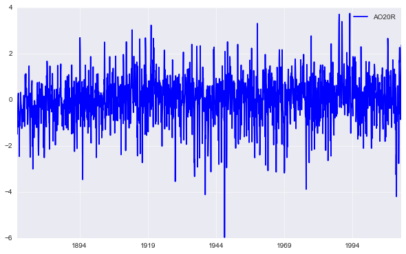

.. code:: python

    print(database['ap']['long_name'])
    plot_climate_index('ap')

.. parsed-literal::

    Ponta Delgada, Azores SLP

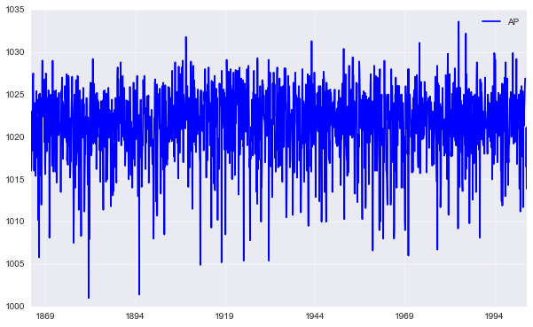

.. code:: python

    print(database['global_t_cru']['long_name'])
    plot_climate_index('global_t_cru')

.. parsed-literal::

    Global Average Temperature Anomaly (CRU)

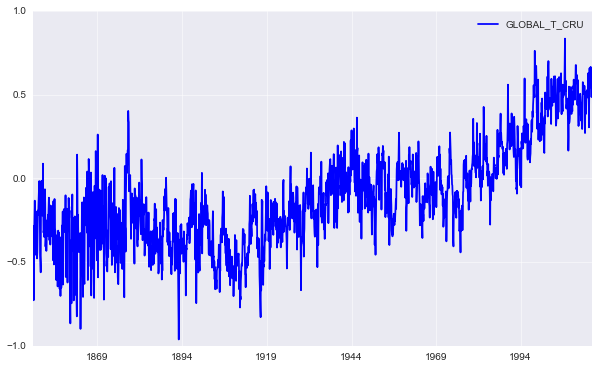

.. code:: python

    print(database['global_t_sst']['long_name'])
    plot_climate_index('global_t_sst')

.. parsed-literal::

    Global Average Temperature & SST Anomalies (Station + SST)

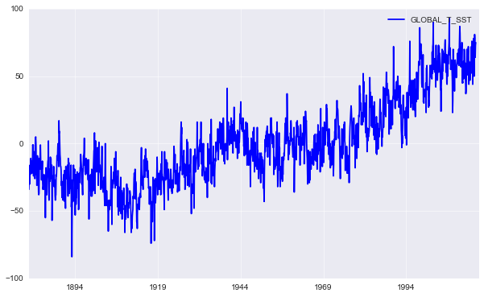

.. code:: python

    print(database['global_t_station']['long_name'])
    plot_climate_index('global_t_station')

.. parsed-literal::

    Global Average Temperature Anomalies (Station Only)

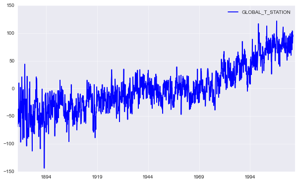

.. code:: python

    print(database['gp']['long_name'])
    plot_climate_index('gp')

.. parsed-literal::

    Gibraltar SLP

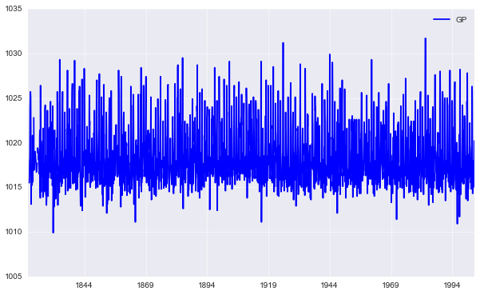

.. code:: python

    print(database['ip']['long_name'])
    plot_climate_index('ip')

.. parsed-literal::

    Iceland SLP

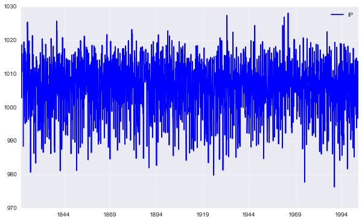

.. code:: python

    print(database['mp']['long_name'])
    plot_climate_index('mp')

.. parsed-literal::

    Madras SLP

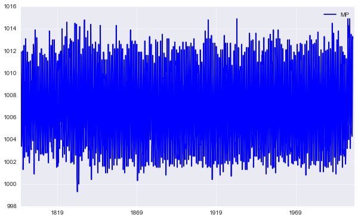

.. code:: python

    print(database['nao']['long_name'])
    plot_climate_index('nao')

.. parsed-literal::

    North Atlantic Oscillation

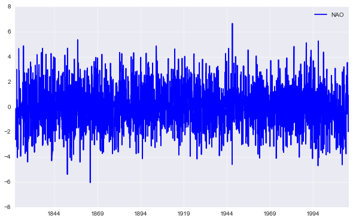

.. code:: python

    print(database['rnao']['long_name'])
    plot_climate_index('rnao')

.. parsed-literal::

    Reconstructed monthly NAO index back to December 1658

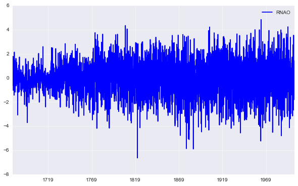

.. code:: python

    print(database['nino12']['long_name'])
    plot_climate_index('nino12')

.. parsed-literal::

    Nino 1+2 SST Index

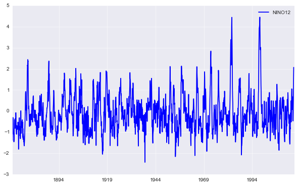

.. code:: python

    print(database['nino3']['long_name'])
    plot_climate_index('nino3')

.. parsed-literal::

    Nino 3 SST Index

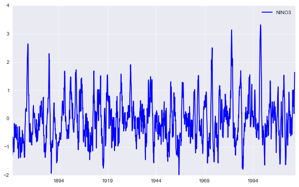

.. code:: python

    print(database['nino34']['long_name'])
    plot_climate_index('nino34')

.. parsed-literal::

    Nino 3.4 SST Index

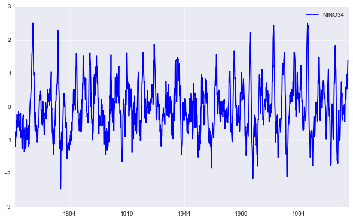

.. code:: python

    print(database['nino4']['long_name'])
    plot_climate_index('nino4')

.. parsed-literal::

    Nino 4 SST Index

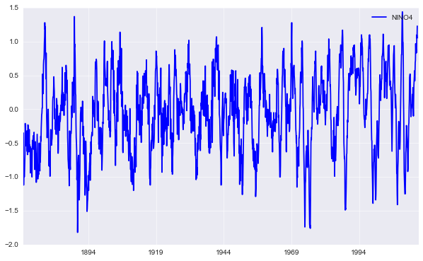

.. code:: python

    print(database['np']['long_name'])
    plot_climate_index('np')

.. parsed-literal::

    North Pacific Index

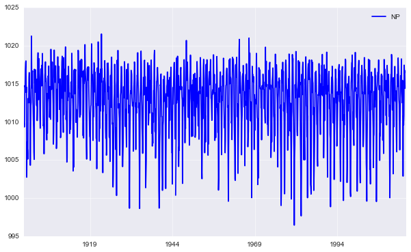

.. code:: python

    print(database['nslp']['long_name'])
    plot_climate_index('nslp')

.. parsed-literal::

    Nagasaki SLP

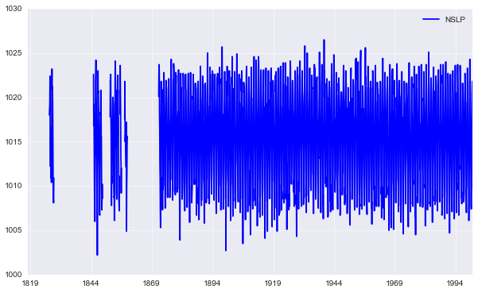

.. code:: python

    print(database['pdo']['long_name'])
    plot_climate_index('pdo')

.. parsed-literal::

    Pacific Decadal Oscillation

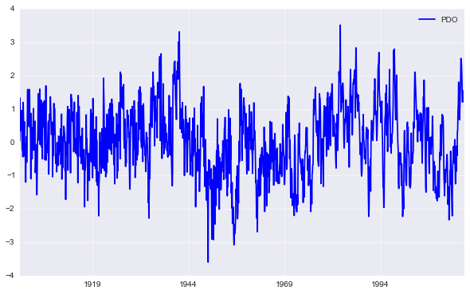

.. code:: python

    print(database['soi']['long_name'])
    plot_climate_index('soi')

.. parsed-literal::

    Southern Oscillation Index

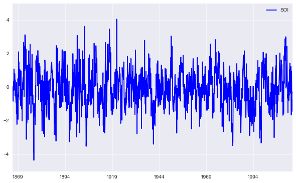

.. code:: python

    print(database['sunspot']['long_name'])
    plot_climate_index('sunspot')

.. parsed-literal::

    Sunspot Index

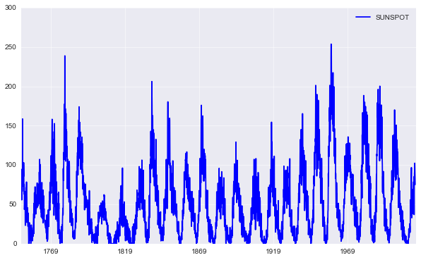

.. code:: python

    print(database['tp']['long_name'])
    plot_climate_index('tp')

.. parsed-literal::

    Trans Polar Index

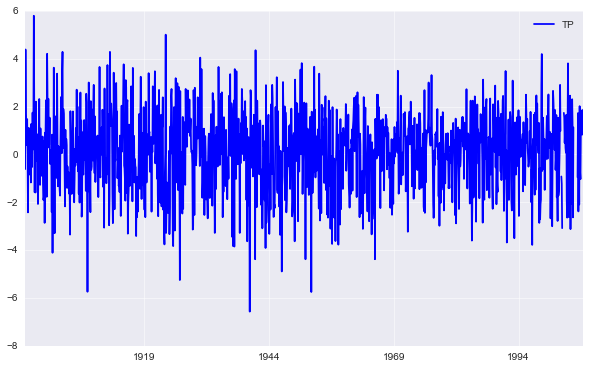

